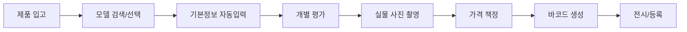

# 중고제품 관리 시스템 설계서

## 1. 개요

### 1.1 비즈니스 특성
- **주요 카테고리**: 전자제품, 가전, 가구
- **재고 특성**: 개별 상품 관리 (동일 모델도 각각 다른 상태)
- **핵심 요구사항**: 개별 상품별 상태, 실물사진, 이력 관리

### 1.2 시스템 목표
- 각 중고제품의 개별 관리
- 효율적인 상품 등록 프로세스
- 정확한 상태 평가 및 가격 책정
- 실물 사진 기반 투명한 거래

## 2. 데이터 구조

### 2.1 3단계 분리 관리 체계

#### Level 1: 카테고리 (Categories)
```typescript
interface Category {
  id: string;
  name: string;
  slug: string;
  subcategories: Subcategory[];
}

// 주요 카테고리 (3개만 운영)
const CATEGORIES = [
  {
    id: "CAT-001",
    name: "전자제품",
    slug: "electronics",
    subcategories: [
      { id: "SUB-001", name: "스마트폰" },
      { id: "SUB-002", name: "노트북" },
      { id: "SUB-003", name: "태블릿" },
      { id: "SUB-004", name: "데스크탑" },
      { id: "SUB-005", name: "모니터" }
    ]
  },
  {
    id: "CAT-002", 
    name: "가전제품",
    slug: "appliances",
    subcategories: [
      { id: "SUB-006", name: "냉장고" },
      { id: "SUB-007", name: "세탁기" },
      { id: "SUB-008", name: "에어컨" },
      { id: "SUB-009", name: "TV" },
      { id: "SUB-010", name: "청소기" }
    ]
  },
  {
    id: "CAT-003",
    name: "가구",
    slug: "furniture",
    subcategories: [
      { id: "SUB-011", name: "침실가구" },
      { id: "SUB-012", name: "거실가구" },
      { id: "SUB-013", name: "주방가구" },
      { id: "SUB-014", name: "사무가구" },
      { id: "SUB-015", name: "수납가구" }
    ]
  }
];
```

#### Level 2: 제품 모델 마스터 (Product Models)
```typescript
interface ProductModel {
  id: string;                  // MOD-XXXXX
  categoryId: string;
  subcategoryId: string;
  brand: string;               // 삼성, LG, 애플 등
  modelName: string;           // RT62K7000SL
  modelYear: number;           // 2019
  originalPrice: number;       // 신품 출시가
  specifications: {
    // 카테고리별 세부 스펙
    [key: string]: any;
  };
  images: string[];           // 제품 카탈로그 이미지
  discontinuedDate?: Date;    // 단종일
}

// 예시: 냉장고 모델
const exampleModel = {
  id: "MOD-00001",
  categoryId: "CAT-002",
  subcategoryId: "SUB-006",
  brand: "삼성",
  modelName: "RT62K7000SL",
  modelYear: 2019,
  originalPrice: 1800000,
  specifications: {
    capacity: "635L",
    type: "상냉장하냉동",
    energyRating: "1등급",
    width: "836mm",
    height: "1780mm",
    depth: "788mm"
  }
};
```

#### Level 3: 개별 상품 (Individual Items)
```typescript
interface IndividualProduct {
  id: string;                    // PRD-2024-XXXXX (고유번호)
  modelId: string;               // 모델 마스터 참조
  
  // 개별 상품 정보
  condition: ConditionGrade;     // 상태 등급
  actualYear: number;            // 실제 제조년도
  usagePeriod: string;           // "2년 사용"
  
  // 가격 정보
  listPrice: number;             // 판매가격
  purchasePrice: number;         // 매입가격
  
  // 실물 정보
  actualPhotos: string[];        // 실물 사진 (최소 6장)
  defects: Defect[];            // 하자 상세
  
  // 관리 정보
  status: ProductStatus;         // 입고/전시/예약/판매완료
  location: string;              // 매장/창고 위치
  barcode: string;              // 바코드/QR코드
  
  // 이력
  purchaseDate: Date;           // 매입일
  listingDate: Date;            // 등록일
  soldDate?: Date;              // 판매일
  
  // 추가 정보
  warranty?: string;            // 남은 보증기간
  accessories: string[];        // 구성품
  notes: string;               // 특이사항
}
```

### 2.2 상태 등급 체계

```typescript
enum ConditionGrade {
  S = "S급 (미개봉/전시품)",
  A = "A급 (사용감 거의 없음)",
  B = "B급 (사용감 있음)",
  C = "C급 (사용감 많음)",
  D = "D급 (부품용/수리필요)"
}

interface ConditionCriteria {
  grade: ConditionGrade;
  description: string;
  checkList: string[];
  priceAdjustment: number;  // 감가율 %
}

const CONDITION_STANDARDS = [
  {
    grade: ConditionGrade.S,
    description: "미개봉 또는 전시품 수준",
    checkList: [
      "포장 미개봉 또는 단순 개봉",
      "사용 흔적 전혀 없음",
      "모든 구성품 완벽",
      "보증서 및 영수증 보유"
    ],
    priceAdjustment: -10  // 신품 대비 10% 할인
  },
  {
    grade: ConditionGrade.A,
    description: "극소 사용감",
    checkList: [
      "6개월 이내 사용",
      "육안으로 하자 확인 어려움",
      "기능 완벽 작동",
      "주요 구성품 모두 보유"
    ],
    priceAdjustment: -25
  }
  // ... B, C, D 등급
];
```

## 3. 운영 프로세스

### 3.1 상품 등록 프로세스



### 3.2 가격 책정 로직

```typescript
function calculatePrice(model: ProductModel, item: IndividualProduct) {
  const { originalPrice } = model;
  const yearsSinceRelease = currentYear - model.modelYear;
  
  // 기본 감가상각 (년 15%)
  const depreciation = Math.min(yearsSinceRelease * 0.15, 0.7);
  
  // 상태별 조정
  const conditionAdjustment = CONDITION_STANDARDS
    .find(s => s.grade === item.condition)
    ?.priceAdjustment || 0;
  
  // 카테고리별 특수 조정
  const categoryAdjustment = getCategoryAdjustment(model.categoryId);
  
  // 최종 가격 계산
  const basePrice = originalPrice * (1 - depreciation);
  const finalPrice = basePrice * (1 + conditionAdjustment/100) * categoryAdjustment;
  
  return {
    suggestedPrice: Math.round(finalPrice / 10000) * 10000,
    minPrice: finalPrice * 0.9,
    maxPrice: finalPrice * 1.1
  };
}
```

## 4. 관리 화면 구성

### 4.1 메뉴 구조
```
/admin
  /dashboard          - 대시보드
  /products           - 개별 상품 목록
  /products/add       - 상품 등록
  /products/[id]      - 상품 상세/수정
  /models             - 모델 마스터 관리
  /models/add         - 모델 등록
  /conditions         - 상태 등급 기준 관리
  /inventory          - 재고 현황
  /reports            - 리포트
```

### 4.2 개별 상품 목록 화면

#### 필터 옵션
- 카테고리 (전자제품/가전/가구)
- 상태 (S/A/B/C/D)
- 브랜드
- 가격대
- 등록일
- 상태 (입고/전시/예약/판매)

#### 표시 컬럼
```typescript
const columns = [
  "고유번호",      // PRD-2024-00001
  "썸네일",        // 대표 이미지
  "카테고리",      // 가전 > 냉장고
  "브랜드/모델",   // 삼성 RT62K7000SL
  "제조년도",      // 2019
  "상태",          // A급
  "판매가격",      // 970,000원
  "입고일",        // 2024-01-15
  "상태",          // 전시중
  "액션"           // 수정/삭제/QR출력
];
```

### 4.3 상품 등록 화면

#### Step 1: 모델 선택
```typescript
// 모델 검색 UI
<ModelSearch>
  <SearchBar placeholder="모델명 또는 제품명 검색" />
  <CategoryFilter />
  <BrandFilter />
  <YearFilter />
</ModelSearch>

// 검색 결과
<ModelList>
  {models.map(model => (
    <ModelCard 
      onClick={() => selectModel(model)}
      showSpecs={true}
    />
  ))}
</ModelList>
```

#### Step 2: 개별 정보 입력
```typescript
<IndividualInfoForm>
  <ConditionSelector 
    grades={CONDITION_STANDARDS}
    showChecklist={true}
  />
  
  <PhotoUploader
    minPhotos={6}
    guidelines={[
      "전면", "후면", "좌측", "우측", 
      "상단", "하자부위"
    ]}
  />
  
  <DefectRecorder>
    <DefectType /> {/* 스크래치/찍힘/변색 등 */}
    <DefectLocation />
    <DefectPhoto />
  </DefectRecorder>
  
  <PriceCalculator
    suggested={calculatedPrice}
    editable={true}
  />
  
  <AccessoryChecker 
    defaultItems={model.defaultAccessories}
  />
</IndividualInfoForm>
```

## 5. 데이터베이스 스키마

```sql
-- 카테고리 테이블
CREATE TABLE categories (
  id VARCHAR(10) PRIMARY KEY,
  name VARCHAR(50) NOT NULL,
  slug VARCHAR(50) NOT NULL,
  order_index INT DEFAULT 0
);

-- 서브카테고리 테이블
CREATE TABLE subcategories (
  id VARCHAR(10) PRIMARY KEY,
  category_id VARCHAR(10) REFERENCES categories(id),
  name VARCHAR(50) NOT NULL,
  order_index INT DEFAULT 0
);

-- 제품 모델 마스터
CREATE TABLE product_models (
  id VARCHAR(20) PRIMARY KEY,
  category_id VARCHAR(10) REFERENCES categories(id),
  subcategory_id VARCHAR(10) REFERENCES subcategories(id),
  brand VARCHAR(50) NOT NULL,
  model_name VARCHAR(100) NOT NULL,
  model_year INT NOT NULL,
  original_price DECIMAL(10,0) NOT NULL,
  specifications JSONB,
  catalog_images TEXT[],
  discontinued_date DATE,
  created_at TIMESTAMP DEFAULT CURRENT_TIMESTAMP,
  updated_at TIMESTAMP DEFAULT CURRENT_TIMESTAMP
);

-- 개별 상품
CREATE TABLE individual_products (
  id VARCHAR(20) PRIMARY KEY,
  model_id VARCHAR(20) REFERENCES product_models(id),
  condition_grade CHAR(1) NOT NULL,
  actual_year INT NOT NULL,
  usage_period VARCHAR(50),
  list_price DECIMAL(10,0) NOT NULL,
  purchase_price DECIMAL(10,0),
  actual_photos TEXT[] NOT NULL,
  defects JSONB,
  status VARCHAR(20) NOT NULL,
  location VARCHAR(100),
  barcode VARCHAR(50) UNIQUE,
  purchase_date DATE NOT NULL,
  listing_date DATE,
  sold_date DATE,
  warranty VARCHAR(100),
  accessories TEXT[],
  notes TEXT,
  created_at TIMESTAMP DEFAULT CURRENT_TIMESTAMP,
  updated_at TIMESTAMP DEFAULT CURRENT_TIMESTAMP
);

-- 상태 변경 이력
CREATE TABLE product_status_history (
  id SERIAL PRIMARY KEY,
  product_id VARCHAR(20) REFERENCES individual_products(id),
  old_status VARCHAR(20),
  new_status VARCHAR(20),
  reason TEXT,
  changed_by VARCHAR(100),
  changed_at TIMESTAMP DEFAULT CURRENT_TIMESTAMP
);
```

## 6. API 엔드포인트

### 6.1 카테고리 관리
```
GET    /api/admin/categories              # 카테고리 목록
GET    /api/admin/categories/:id          # 카테고리 상세
POST   /api/admin/categories              # 카테고리 생성
PUT    /api/admin/categories/:id          # 카테고리 수정
DELETE /api/admin/categories/:id          # 카테고리 삭제
```

### 6.2 모델 마스터 관리
```
GET    /api/admin/models                  # 모델 목록
GET    /api/admin/models/:id              # 모델 상세
POST   /api/admin/models                  # 모델 등록
PUT    /api/admin/models/:id              # 모델 수정
DELETE /api/admin/models/:id              # 모델 삭제
GET    /api/admin/models/search           # 모델 검색
```

### 6.3 개별 상품 관리
```
GET    /api/admin/products                # 상품 목록
GET    /api/admin/products/:id            # 상품 상세
POST   /api/admin/products                # 상품 등록
PUT    /api/admin/products/:id            # 상품 수정
DELETE /api/admin/products/:id            # 상품 삭제
POST   /api/admin/products/:id/photos     # 사진 업로드
GET    /api/admin/products/:id/barcode    # 바코드 생성
POST   /api/admin/products/:id/status     # 상태 변경
```

### 6.4 가격 관리
```
POST   /api/admin/pricing/calculate       # 가격 계산
GET    /api/admin/pricing/history/:modelId # 모델별 가격 이력
POST   /api/admin/pricing/adjust          # 가격 일괄 조정
```

## 7. 핵심 기능 구현 우선순위

### Phase 1 (MVP)
1. ✅ 카테고리 구조 수정 (전자제품/가전/가구)
2. ⬜ 개별 상품 CRUD
3. ⬜ 실물 사진 업로드
4. ⬜ 상태 등급 관리
5. ⬜ 기본 가격 책정

### Phase 2 (확장)
1. ⬜ 모델 마스터 DB 구축
2. ⬜ 자동 가격 계산
3. ⬜ 바코드/QR 코드 생성
4. ⬜ 재고 현황 대시보드

### Phase 3 (고급)
1. ⬜ 가격 트렌드 분석
2. ⬜ 자동 상태 평가 (AI)
3. ⬜ 경쟁사 가격 모니터링
4. ⬜ 판매 예측 모델

## 8. 성공 지표

### 운영 효율성
- 상품 등록 시간: 5분 이내
- 일일 처리 가능 수량: 50개 이상
- 가격 책정 정확도: ±10% 이내

### 비즈니스 성과
- 재고 회전율: 월 2회 이상
- 평균 마진율: 25% 이상
- 반품율: 5% 이하

## 9. 주의사항

### 법적 요구사항
- 중고제품 판매 관련 법규 준수
- 하자 고지 의무
- 개인정보 보호 (이전 소유자 정보)

### 운영 리스크
- 도난품 확인 프로세스
- 위조품 검증
- A/S 책임 범위 명확화

## 10. 향후 확장 계획

### 추가 기능
- [ ] 온라인 매입 신청
- [ ] 실시간 시세 조회
- [ ] B2B 대량 거래
- [ ] 위탁 판매 시스템

### 기술 고도화
- [ ] AI 기반 상태 평가
- [ ] 블록체인 이력 관리
- [ ] AR 제품 미리보기
- [ ] 자동 가격 협상 봇