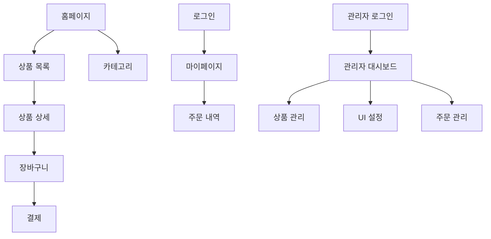

# 📄 페이지 구조 문서
*E-Market Korea - 중고 상품 커머스 플랫폼*

## 📊 페이지 개요
```yaml
총 페이지 수: 46개 페이지
API 엔드포인트: 80개 이상 라우트
레이아웃: 2개 (메인, 관리자)
특화 기능: 중고 상품 거래, 다국어 지원
```

## 🏗️ 페이지 계층 구조

### 메인 애플리케이션 페이지

#### 1. 홈페이지 관련
- **`/` (`app/page.tsx`)**: 메인 홈페이지
- **`/home-v2` (`app/home-v2/page.tsx`)**: 새로운 버전의 홈페이지

#### 2. 인증 및 사용자 관리
- **`/auth/login` (`app/auth/login/page.tsx`)**: 로그인 페이지
- **`/auth/register` (`app/auth/register/page.tsx`)**: 회원가입 페이지
- **`/auth/forgot-password` (`app/auth/forgot-password/page.tsx`)**: 비밀번호 찾기
- **`/mypage` (`app/mypage/page.tsx`)**: 마이페이지

#### 3. 상품 관련 페이지
- **`/products` (`app/products/page.tsx`)**: 상품 목록 페이지
- **`/products/[slug]` (`app/products/[slug]/page.tsx`)**: 상품 상세 페이지
- **`/categories` (`app/categories/page.tsx`)**: 카테고리 목록
- **`/categories/[slug]` (`app/categories/[slug]/page.tsx`)**: 카테고리별 상품 목록
- **`/search` (`app/search/page.tsx`)**: 검색 결과 페이지

#### 4. 주문 및 결제
- **`/cart` (`app/cart/page.tsx`)**: 장바구니 페이지
- **`/checkout` (`app/checkout/page.tsx`)**: 결제 페이지

#### 5. 고객 지원 및 커뮤니티
- **`/support` (`app/support/page.tsx`)**: 고객 지원 센터
- **`/faq` (`app/faq/page.tsx`)**: 자주 묻는 질문
- **`/inquiry` (`app/inquiry/page.tsx`)**: 1:1 문의
- **`/community` (`app/community/page.tsx`)**: 커뮤니티 페이지
- **`/reviews` (`app/reviews/page.tsx`)**: 리뷰 페이지

#### 6. 특수 페이지
- **`/events` (`app/events/page.tsx`)**: 이벤트 페이지
- **`/plugstory` (`app/plugstory/page.tsx`)**: 플러그스토리 페이지

### 관리자 페이지 (`/admin/`)

#### 1. 대시보드
- **`/admin` (`app/admin/page.tsx`)**: 관리자 메인 대시보드

#### 2. 상품 관리
- **`/admin/products` (`app/admin/products/page.tsx`)**: 상품 목록 관리
- **`/admin/products/create` (`app/admin/products/create/page.tsx`)**: 상품 등록
- **`/admin/products/edit/[id]` (`app/admin/products/edit/[id]/page.tsx`)**: 상품 수정
- **`/admin/categories` (`app/admin/categories/page.tsx`)**: 카테고리 관리
- **`/admin/inventory` (`app/admin/inventory/page.tsx`)**: 재고 관리

#### 3. 주문 및 결제 관리
- **`/admin/orders` (`app/admin/orders/page.tsx`)**: 주문 관리
- **`/admin/payments` (`app/admin/payments/page.tsx`)**: 결제 관리
- **`/admin/corporate-payments` (`app/admin/corporate-payments/page.tsx`)**: 법인 결제 관리
- **`/admin/open-banking` (`app/admin/open-banking/page.tsx`)**: 오픈뱅킹 관리

#### 4. 고객 및 리뷰 관리
- **`/admin/customers` (`app/admin/customers/page.tsx`)**: 고객 관리
- **`/admin/reviews` (`app/admin/reviews/page.tsx`)**: 리뷰 관리
- **`/admin/coupons` (`app/admin/coupons/page.tsx`)**: 쿠폰 관리

#### 5. UI 구성 관리
- **`/admin/ui-config` (`app/admin/ui-config/page.tsx`)**: UI 설정 메인 페이지
- **`/admin/sections` (`app/admin/sections/page.tsx`)**: 섹션 관리

##### UI 섹션별 세부 관리
- **`/admin/ui-config/sections/hero` (`app/admin/ui-config/sections/hero/page.tsx`)**: 메인 배너 관리
- **`/admin/ui-config/sections/recommended` (`app/admin/ui-config/sections/recommended/page.tsx`)**: 추천 섹션 관리
- **`/admin/ui-config/sections/ranking` (`app/admin/ui-config/sections/ranking/page.tsx`)**: 랭킹 섹션 관리
- **`/admin/ui-config/sections/promo` (`app/admin/ui-config/sections/promo/page.tsx`)**: 프로모션 섹션 관리
- **`/admin/ui-config/sections/quicklinks` (`app/admin/ui-config/sections/quicklinks/page.tsx`)**: 빠른 링크 관리
- **`/admin/ui-config/sections/new` (`app/admin/ui-config/sections/new/page.tsx`)**: 신상품 섹션 관리
- **`/admin/ui-config/sections/category` (`app/admin/ui-config/sections/category/page.tsx`)**: 카테고리 섹션 관리
- **`/admin/ui-config/sections/product-grid` (`app/admin/ui-config/sections/product-grid/page.tsx`)**: 상품 그리드 관리
- **`/admin/ui-config/sections/[id]` (`app/admin/ui-config/sections/[id]/page.tsx`)**: 동적 섹션 관리

#### 6. 다국어 및 번역 관리
- **`/admin/language-packs` (`app/admin/language-packs/page.tsx`)**: 언어팩 관리

#### 7. 외부 시스템 연동
- **`/admin/ecount` (`app/admin/ecount/page.tsx`)**: 이카운트 연동 관리
- **`/admin/tax-invoices` (`app/admin/tax-invoices/page.tsx`)**: 세금계산서 관리

#### 8. 시스템 관리
- **`/admin/settings` (`app/admin/settings/page.tsx`)**: 시스템 설정
- **`/admin/notifications` (`app/admin/notifications/page.tsx`)**: 알림 관리
- **`/admin/popup-alerts` (`app/admin/popup-alerts/page.tsx`)**: 팝업 알림 관리

## 🎯 페이지별 기능 매핑

### 사용자 대상 페이지

#### 홈페이지 시스템
```typescript
interface HomePageStructure {
  // 메인 홈페이지
  mainHome: {
    path: '/';
    features: ['동적 섹션', '상품 추천', '카테고리 네비게이션'];
    sections: ['hero', 'featured', 'categories', 'new-arrivals'];
  };
  
  // 새 버전 홈페이지
  homeV2: {
    path: '/home-v2';
    features: ['개선된 UI', '향상된 성능', '새로운 섹션'];
    experimentalFeatures: true;
  };
}
```

#### 인증 시스템
```typescript
interface AuthPages {
  login: {
    path: '/auth/login';
    features: ['소셜 로그인', '이메일 로그인', '자동 로그인'];
    providers: ['Google', 'Naver', 'Kakao'];
  };
  
  register: {
    path: '/auth/register';
    features: ['이메일 인증', '약관 동의', '프로필 설정'];
    validation: 'real-time';
  };
  
  forgotPassword: {
    path: '/auth/forgot-password';
    features: ['이메일 인증', '비밀번호 재설정'];
  };
}
```

#### 상품 관련 페이지
```typescript
interface ProductPages {
  productList: {
    path: '/products';
    features: ['필터링', '정렬', '페이지네이션', '무한스크롤'];
    filters: ['가격', '카테고리', '상품상태', '지역'];
  };
  
  productDetail: {
    path: '/products/[slug]';
    features: ['이미지 갤러리', '리뷰', '연관상품', '판매자 정보'];
    seo: 'dynamic-meta';
  };
  
  categories: {
    path: '/categories';
    features: ['계층형 구조', '상품 수량 표시', '이미지 썸네일'];
  };
  
  categoryProducts: {
    path: '/categories/[slug]';
    features: ['카테고리별 필터', 'SEO 최적화', '브레드크럼'];
  };
}
```

#### 주문 및 결제
```typescript
interface OrderPages {
  cart: {
    path: '/cart';
    features: ['수량 조절', '쿠폰 적용', '배송비 계산', '임시저장'];
    realTimeSync: true;
  };
  
  checkout: {
    path: '/checkout';
    features: ['주소 입력', '결제 수단', '주문 확인', '영수증'];
    paymentMethods: ['신용카드', '계좌이체', '간편결제'];
  };
}
```

### 관리자 대상 페이지

#### 상품 관리 시스템
```typescript
interface AdminProductPages {
  productList: {
    path: '/admin/products';
    features: ['일괄 관리', '상태 변경', '검색 필터', '엑셀 업로드'];
    bulkActions: ['삭제', '상태변경', '카테고리 이동'];
  };
  
  productCreate: {
    path: '/admin/products/create';
    features: ['다중 이미지 업로드', '옵션 관리', '번역 지원'];
    validation: 'step-by-step';
  };
  
  productEdit: {
    path: '/admin/products/edit/[id]';
    features: ['히스토리 관리', '미리보기', '자동 저장'];
    versionControl: true;
  };
}
```

#### UI 관리 시스템
```typescript
interface AdminUIPages {
  uiConfig: {
    path: '/admin/ui-config';
    features: ['탭 기반 관리', '실시간 미리보기', '드래그앤드롭'];
    sections: ['header', 'footer', 'sections', 'categories'];
  };
  
  sectionManagement: {
    paths: [
      '/admin/ui-config/sections/hero',
      '/admin/ui-config/sections/recommended',
      '/admin/ui-config/sections/ranking',
      // ... 기타 섹션들
    ];
    commonFeatures: ['순서 변경', '활성화/비활성화', '다국어 지원'];
  };
}
```

## 🔗 페이지 간 연동 구조

### 네비게이션 플로우


### 권한 기반 접근 제어
```typescript
interface PageAccess {
  public: [
    '/', '/products', '/categories', '/search',
    '/auth/login', '/auth/register'
  ];
  
  authenticated: [
    '/mypage', '/cart', '/checkout'
  ];
  
  admin: [
    '/admin/**'
  ];
  
  superAdmin: [
    '/admin/settings', '/admin/language-packs'
  ];
}
```

## 📱 반응형 지원

### 모바일 최적화 페이지
- 모든 페이지에서 모바일 우선 설계 적용
- 터치 친화적 인터페이스
- 스와이프 제스처 지원 (상품 이미지, 카테고리 네비게이션)

### 브레이크포인트 전략
```css
/* 공통 브레이크포인트 */
.responsive-page {
  @apply px-4 sm:px-6 md:px-8 lg:px-12;
}

/* 페이지별 특화 반응형 */
.product-grid {
  @apply grid-cols-2 sm:grid-cols-3 md:grid-cols-4 lg:grid-cols-5;
}

.admin-dashboard {
  @apply flex-col lg:flex-row;
}
```

## 🌐 다국어 지원

### 언어별 라우팅
- URL 기반 언어 감지: `?lang=ko|en|jp`
- 쿠키 기반 언어 저장
- 자동 언어 감지 (Accept-Language 헤더)

### 페이지별 번역 지원
```typescript
interface PageTranslations {
  static: {
    // 정적 텍스트 (UI 라벨, 버튼 등)
    scope: 'compile-time';
    source: '/lang/[locale].json';
  };
  
  dynamic: {
    // 동적 콘텐츠 (상품명, 설명 등)
    scope: 'runtime';
    source: 'database';
    fallback: 'korean';
  };
}
```

## ⚡ 성능 최적화

### 페이지 로딩 전략
```typescript
interface PageLoadingStrategy {
  homepage: {
    strategy: 'SSG';
    revalidation: '5 minutes';
    preload: ['featured-products', 'categories'];
  };
  
  productList: {
    strategy: 'ISR';
    revalidation: '10 minutes';
    caching: 'edge';
  };
  
  productDetail: {
    strategy: 'SSR';
    caching: 'redis-5min';
    preload: ['related-products'];
  };
  
  admin: {
    strategy: 'CSR';
    auth: 'required';
    prefetch: false;
  };
}
```

### 코드 분할 전략
- 페이지 단위 자동 코드 분할
- 관리자 페이지 별도 번들
- UI 섹션 컴포넌트 동적 로딩
- 써드파티 라이브러리 지연 로딩

## 🔍 SEO 및 메타데이터

### 페이지별 SEO 전략
```typescript
interface SEOStrategy {
  homepage: {
    title: 'E-Market Korea - 중고 상품 커머스';
    description: '안전한 중고 거래 플랫폼';
    keywords: ['중고거래', '커머스', '안전거래'];
    schema: 'WebSite';
  };
  
  productDetail: {
    title: '[상품명] - E-Market Korea';
    description: '[상품 설명 요약]';
    schema: 'Product';
    openGraph: {
      images: ['상품 대표 이미지'];
      type: 'product';
    };
  };
  
  categoryPage: {
    title: '[카테고리명] 상품 목록 - E-Market Korea';
    description: '[카테고리] 관련 중고 상품을 찾아보세요';
    schema: 'CollectionPage';
  };
}
```

## 📊 페이지 성능 메트릭스

### 목표 성능 지표
- **홈페이지**: LCP < 2.5s, FID < 100ms, CLS < 0.1
- **상품 목록**: 초기 로딩 < 3s, 무한스크롤 < 500ms
- **상품 상세**: 이미지 로딩 < 1s, 인터랙션 < 200ms
- **관리자 페이지**: 초기 로딩 < 5s, 데이터 조작 < 1s

### 모니터링 전략
- Core Web Vitals 추적
- 사용자 행동 분석
- 페이지별 이탈률 모니터링
- API 응답 시간 추적

---

*이 문서는 E-Market Korea 프로젝트의 완전한 페이지 구조 매뉴얼입니다.*