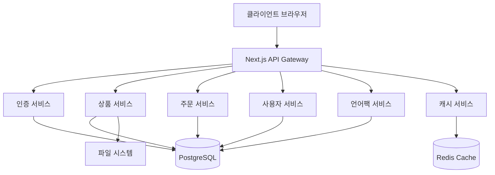

# 🏗️ 프로젝트 아키텍처 문서
*E-Market Korea - 중고 상품 커머스 플랫폼*

## 📊 시스템 아키텍처 개요
```yaml
프로젝트명: Korean Enterprise Commerce
버전: 1.0.0
아키텍처: Next.js 15 App Router + PostgreSQL
목표: 동시접속 1만명 지원 엔터프라이즈 커머스
특화: 해외 노동자 대상 중고 거래 플랫폼
성능: ISR + 3단계 캐싱 + Redis 클러스터
```

## 🏛️ 전체 시스템 아키텍처

### 계층형 아키텍처 (Layered Architecture)
```
┌─────────────────────────────────────────────────────────────┐
│                    Presentation Layer                       │
│  Next.js 15 App Router + React 19 + TypeScript + Tailwind  │
├─────────────────────────────────────────────────────────────┤
│                    Application Layer                        │
│  API Routes + Server Actions + Middleware + Auth           │
├─────────────────────────────────────────────────────────────┤
│                     Business Layer                         │
│  Service Classes + Hooks + Validation + Language Packs    │
├─────────────────────────────────────────────────────────────┤
│                      Data Layer                            │
│  PostgreSQL + Redis + File System + External APIs         │
└─────────────────────────────────────────────────────────────┘
```

### 마이크로서비스 지향 설계


## 🛠️ 기술 스택 및 의존성

### Core Framework
```typescript
// package.json 주요 의존성
{
  "next": "15.4.6",           // React 풀스택 프레임워크
  "react": "19.1.0",          // UI 라이브러리 (최신 버전)
  "react-dom": "19.1.0",      // DOM 렌더링
  "typescript": "^5",         // 정적 타입 검사
}
```

### UI/UX Stack
```typescript
{
  // 디자인 시스템
  "tailwindcss": "^3.4.17",           // CSS 프레임워크
  "class-variance-authority": "^0.7.1", // 컴포넌트 변형 관리
  "clsx": "^2.1.1",                   // 조건부 클래스 이름
  "tailwind-merge": "^3.3.1",         // Tailwind 클래스 병합
  
  // UI 컴포넌트 (Radix UI 기반)
  "@radix-ui/react-avatar": "^1.1.10",
  "@radix-ui/react-checkbox": "^1.3.2",
  "@radix-ui/react-dialog": "^1.1.14",
  "@radix-ui/react-dropdown-menu": "^2.1.15",
  "@radix-ui/react-select": "^2.2.5",
  
  // 아이콘 및 애니메이션
  "lucide-react": "^0.539.0",         // 아이콘 라이브러리
  "sonner": "^2.0.7",                 // Toast 알림
}
```

### Data Management
```typescript
{
  // 데이터베이스
  "pg": "^8.16.3",                    // PostgreSQL 드라이버
  "ioredis": "^5.7.0",               // Redis 클라이언트
  
  // API 및 GraphQL
  "@apollo/server": "^5.0.0",        // GraphQL 서버
  "graphql": "^16.11.0",             // GraphQL 스키마
  "axios": "^1.11.0",                // HTTP 클라이언트
  
  // 상태 관리
  "zustand": "^5.0.7",               // 경량 상태 관리
  "@tanstack/react-query": "^5.85.0", // 서버 상태 관리
}
```

### DevOps & Monitoring
```typescript
{
  // 개발 도구
  "tsx": "^4.20.3",                  // TypeScript 실행
  "node-cron": "^4.2.1",            // 작업 스케줄링
  "sharp": "^0.34.3",               // 이미지 처리
  
  // 테스팅
  "playwright": "^1.55.0",           // E2E 테스팅
  "jest": "^29",                     // 단위 테스팅 (설정 예정)
  
  // 컨테이너화
  "podman-compose": "latest",        // 컨테이너 오케스트레이션
}
```

## 📁 프로젝트 구조 분석

### Next.js App Router 구조
```
app/                          # Next.js 15 App Router
├── globals.css              # 전역 스타일
├── layout.tsx               # 루트 레이아웃
├── page.tsx                 # 홈페이지 (ISR 적용)
├── loading.tsx              # 로딩 UI
├── error.tsx                # 에러 바운더리
├── not-found.tsx            # 404 페이지
│
├── (auth)/                  # 인증 관련 페이지 그룹
│   ├── login/page.tsx       # 로그인 (Suspense 래핑)
│   ├── register/page.tsx    # 회원가입
│   └── forgot-password/page.tsx
│
├── products/                # 상품 관련 페이지
│   ├── page.tsx            # 상품 목록 (SSG + ISR)
│   └── [slug]/             # 동적 상품 상세
│       ├── page.tsx        # SSG 상품 상세
│       └── ProductDetailClient.tsx
│
├── admin/                   # 관리자 패널
│   ├── layout.tsx          # 관리자 전용 레이아웃
│   ├── page.tsx            # 대시보드
│   └── [various]/          # 각종 관리 기능
│
└── api/                     # API Routes
    ├── auth/               # 인증 API
    ├── products/           # 상품 API
    ├── admin/              # 관리자 API
    └── health/             # 헬스체크
```

### 서비스 레이어 구조
```
lib/
├── db/                      # 데이터베이스 계층
│   ├── index.ts            # 메인 DB 연결
│   ├── redis.ts            # Redis 연결
│   └── migrations/         # 마이그레이션 파일
│
├── services/               # 비즈니스 로직
│   ├── language-manager.ts # 언어팩 관리 서비스
│   ├── json-language.service.ts # JSON 언어팩 서비스
│   └── auth.service.ts     # 인증 서비스
│
├── cache/                  # 캐싱 시스템
│   ├── language-cache.ts   # 3단계 언어팩 캐싱
│   ├── language-packs.ts   # 언어팩 캐시 관리
│   └── preload-service.ts  # 홈페이지 프리로딩
│
├── utils/                  # 유틸리티
│   ├── language.ts         # 언어 감지 및 처리
│   ├── auth.ts            # 인증 유틸리티
│   └── validation.ts       # 데이터 검증
│
└── hooks/                  # React Hooks
    ├── useAuth.ts          # 인증 훅
    ├── useLanguage.ts      # 언어 훅
    └── useCart.ts          # 장바구니 훅
```

### 컴포넌트 구조
```
components/
├── ui/                     # shadcn/ui 기반 UI 컴포넌트
│   ├── button.tsx          # 재사용 가능한 버튼
│   ├── card.tsx            # 카드 컴포넌트
│   ├── sidebar.tsx         # 사이드바 (관리자용)
│   └── [others]/           # 기타 UI 컴포넌트
│
├── layout/                 # 레이아웃 컴포넌트
│   ├── header.tsx          # 사이트 헤더
│   ├── footer.tsx          # 사이트 푸터
│   └── navigation.tsx      # 네비게이션
│
├── product/                # 상품 관련 컴포넌트
│   ├── ProductCard.tsx     # 상품 카드
│   ├── ProductGrid.tsx     # 상품 그리드
│   └── ProductFilter.tsx   # 상품 필터
│
└── admin/                  # 관리자 전용 컴포넌트
    ├── dashboard/          # 대시보드 컴포넌트
    ├── forms/              # 폼 컴포넌트
    └── tables/             # 테이블 컴포넌트
```

## 🔧 설정 및 구성 파일

### Next.js 설정 (`next.config.mjs`)
```javascript
const nextConfig = {
  output: 'standalone',              // Docker 배포용 독립 실행
  
  // 개발 효율성을 위한 설정
  eslint: { ignoreDuringBuilds: true },
  typescript: { ignoreBuildErrors: true },
  
  // 이미지 최적화
  images: {
    remotePatterns: [/* 외부 이미지 소스 허용 */],
    formats: ['image/avif', 'image/webp'],
  },
  
  // 서버 액션 설정
  experimental: {
    serverActions: { bodySizeLimit: '10mb' },
  },
  
  // 보안 헤더 설정
  async headers() {
    return [{
      source: '/api/:path*',
      headers: [
        { key: 'X-Frame-Options', value: 'SAMEORIGIN' },
        { key: 'X-Content-Type-Options', value: 'nosniff' },
        { key: 'Strict-Transport-Security', value: 'max-age=31536000; includeSubDomains' },
        /* ... 기타 보안 헤더 */
      ],
    }];
  },
};
```

### Tailwind CSS 설정 (`tailwind.config.js`)
```javascript
module.exports = {
  darkMode: 'class',                 // 클래스 기반 다크모드
  content: [
    './pages/**/*.{js,ts,jsx,tsx,mdx}',
    './components/**/*.{js,ts,jsx,tsx,mdx}',
    './app/**/*.{js,ts,jsx,tsx,mdx}',
  ],
  theme: {
    extend: {
      colors: {
        background: 'hsl(var(--background))',
        foreground: 'hsl(var(--foreground))',
      },
    },
  },
};
```

### TypeScript 설정 (`tsconfig.json`)
```json
{
  "compilerOptions": {
    "target": "es5",
    "lib": ["dom", "dom.iterable", "es6"],
    "allowJs": true,
    "skipLibCheck": true,
    "strict": true,
    "noEmit": true,
    "esModuleInterop": true,
    "module": "esnext",
    "moduleResolution": "bundler",
    "resolveJsonModule": true,
    "isolatedModules": true,
    "jsx": "preserve",
    "incremental": true,
    "plugins": [{ "name": "next" }],
    "baseUrl": ".",
    "paths": {
      "@/*": ["./*"]          // 절대 경로 임포트
    }
  }
}
```

## 🗄️ 데이터베이스 아키텍처

### PostgreSQL 스키마 설계
```sql
-- 계층형 테이블 구조
categories (계층형 카테고리)
├── products (상품 - 중고 거래 특화)
    ├── product_attributes (상품 속성)
    ├── product_images (상품 이미지)
    └── reviews (리뷰 시스템)

-- 설정 및 메타데이터
site_config (사이트 설정)
language_settings (언어 설정)
language_pack_keys ←→ language_pack_translations (다국어 시스템)
ui_menus (UI 메뉴 구조)
```

### Redis 캐싱 구조
```
Redis Keys:
├── language:packs:*           # 언어팩 캐시 (30분 TTL)
├── products:featured:*        # 추천 상품 (15분 TTL)
├── categories:tree:*          # 카테고리 트리 (1시간 TTL)
├── ui:sections:*              # UI 섹션 설정 (30분 TTL)
└── user:sessions:*            # 사용자 세션 (24시간 TTL)
```

## 🚀 성능 최적화 아키텍처

### 3단계 캐싱 시스템
```typescript
interface CacheStrategy {
  level1: {
    name: '메모리 캐시';
    storage: 'Map<string, CacheData>';
    ttl: '5분';
    performance: '< 1ms';
  };
  level2: {
    name: 'Redis 캐시';
    storage: 'Redis 클러스터';
    ttl: '30분';
    performance: '< 10ms';
  };
  level3: {
    name: '데이터베이스';
    storage: 'PostgreSQL';
    ttl: 'None';
    performance: '< 50ms';
  };
}
```

### ISR (Incremental Static Regeneration)
```typescript
// app/page.tsx - 홈페이지
export const revalidate = 300; // 5분마다 재생성

// app/products/[slug]/page.tsx - 상품 상세
export async function generateStaticParams() {
  // 인기 상품들을 빌드 타임에 pre-generate
}

export const dynamicParams = true; // 새로운 상품도 동적 생성
export const revalidate = 3600; // 1시간마다 재검증
```

### 프리로딩 시스템
```typescript
// lib/cache/preload-service.ts
interface PreloadStrategy {
  homepage: {
    products: '추천 상품 8개 + 신상품 8개';
    categories: '전체 카테고리 트리';
    languagePacks: '필수 언어팩 키';
    staticTexts: '정적 UI 텍스트';
  };
  performance: {
    loadTime: '< 200ms';
    cacheHit: '> 90%';
    memoryUsage: '< 100MB';
  };
}
```

## 🔒 보안 아키텍처

### 인증 및 권한 관리
```typescript
interface SecurityArchitecture {
  authentication: {
    strategy: 'JWT + Refresh Token';
    storage: 'HttpOnly Cookie + LocalStorage';
    expiry: 'Access: 15min, Refresh: 7days';
  };
  authorization: {
    model: 'Role-Based Access Control (RBAC)';
    roles: ['USER', 'ADMIN', 'SUPER_ADMIN'];
    permissions: 'Dynamic Permission Matrix';
  };
  dataProtection: {
    encryption: 'bcryptjs (password hashing)';
    validation: 'Zod Schema Validation';
    sanitization: 'Input Sanitization';
  };
}
```

### API 보안
```typescript
// next.config.mjs 보안 헤더
const securityHeaders = [
  { key: 'X-Frame-Options', value: 'SAMEORIGIN' },
  { key: 'X-Content-Type-Options', value: 'nosniff' },
  { key: 'Strict-Transport-Security', value: 'max-age=31536000; includeSubDomains' },
  { key: 'X-XSS-Protection', value: '1; mode=block' },
  { key: 'Referrer-Policy', value: 'strict-origin-when-cross-origin' },
];
```

## 🌐 국제화 아키텍처

### 다국어 시스템 설계
```typescript
interface I18nArchitecture {
  languages: ['ko', 'en', 'jp'];
  detection: {
    priority: ['URL params', 'Accept-Language', 'Cookie', 'Default'];
    storage: 'Cookie + LocalStorage';
  };
  delivery: {
    static: 'JSON files in public/i18n/';
    dynamic: 'PostgreSQL language_pack_* tables';
    cache: '3-level caching (Memory → Redis → DB)';
  };
  fallback: {
    strategy: 'Korean as default';
    graceful: 'Show key if translation missing';
  };
}
```

### 언어팩 서비스 아키텍처
```typescript
// lib/services/json-language.service.ts
class JsonLanguageService {
  private cache: Map<LanguageCode, JsonLanguageData>;
  private cacheExpiry: Map<LanguageCode, number>;
  
  // 섹션별 업데이트 지원
  async updateSection(sectionId: string, sectionData: Record<LanguageCode, any>): Promise<SyncResult>
  async toggleSectionVisibility(sectionId: string, visible: boolean): Promise<SyncResult>
  
  // 파일 시스템 동기화
  async validateFileSystem(): Promise<ValidationResult>
}
```

## 📊 모니터링 및 로깅

### 시스템 모니터링
```typescript
interface MonitoringSystem {
  health: {
    endpoint: '/api/health';
    checks: ['Database', 'Redis', 'File System', 'Memory'];
    interval: '30초';
  };
  performance: {
    metrics: ['Response Time', 'Throughput', 'Error Rate'];
    alerts: ['> 5초 응답', '> 5% 에러율', '> 80% 메모리'];
  };
  logging: {
    levels: ['ERROR', 'WARN', 'INFO', 'DEBUG'];
    storage: 'File System + Console';
    format: 'Structured JSON';
  };
}
```

### 크론 작업 및 배치
```typescript
// package.json scripts
{
  "cache:cron": "tsx scripts/cache-regeneration-cron.ts",
  "monitoring:start": "tsx scripts/monitoring-cron.ts",
  "cache:status": "curl http://localhost:3000/api/admin/regenerate-cache",
}
```

## 🐳 배포 아키텍처

### 컨테이너화 전략
```yaml
# docker/podman-compose.yml
services:
  app:
    image: next-commerce:latest
    ports: ["3000:3000"]
    environment:
      - NODE_ENV=production
      - DATABASE_URL=postgresql://...
      - REDIS_URL=redis://...
    
  postgres:
    image: postgres:16
    volumes: ["./data/postgres:/var/lib/postgresql/data"]
    
  redis:
    image: redis:7
    volumes: ["./data/redis:/data"]
    
  nginx:
    image: nginx:alpine
    ports: ["80:80", "443:443"]
    volumes: ["./nginx.conf:/etc/nginx/nginx.conf"]
```

### 스케일링 전략
```typescript
interface ScalingStrategy {
  horizontal: {
    webServers: 'Multiple Next.js instances behind load balancer';
    database: 'PostgreSQL read replicas';
    cache: 'Redis cluster with sharding';
  };
  vertical: {
    target: '동시접속 1만명';
    specs: 'CPU: 4-8 cores, Memory: 8-16GB, Storage: SSD';
  };
  cdn: {
    static: 'Images, CSS, JS via CDN';
    api: 'API responses caching';
  };
}
```

## 🔧 개발 환경 아키텍처

### 개발 도구 및 워크플로우
```typescript
interface DevelopmentStack {
  runtime: {
    node: '>=18.0.0';
    npm: '>=8.0.0';
    package_manager: 'npm';
  };
  development: {
    framework: 'Next.js 15 (App Router)';
    typescript: 'Strict mode enabled';
    linting: 'ESLint + TypeScript ESLint';
    formatting: 'Prettier (미설정)';
  };
  testing: {
    unit: 'Jest (설정 예정)';
    integration: 'Jest + React Testing Library';
    e2e: 'Playwright';
    load: 'Custom Node.js script';
  };
  database: {
    development: 'Local PostgreSQL + Redis';
    migration: 'Custom SQL scripts';
    seeding: 'TypeScript seed scripts';
  };
}
```

### 빌드 및 배포 프로세스
```bash
# 개발 환경
npm run dev              # Next.js 개발 서버 + 커스텀 서버
npm run cache:generate   # JSON 캐시 파일 생성
npm run db:init          # 데이터베이스 초기화

# 프로덕션 빌드
npm run build           # Next.js 빌드 (standalone 모드)
npm run start           # 프로덕션 서버 시작
npm run health-check    # 헬스체크 (curl)

# 컨테이너 배포
npm run podman:setup    # 컨테이너 환경 설정
npm run podman:up       # 컨테이너 시작
npm run podman:logs     # 로그 모니터링
```

## 📈 확장성 및 미래 계획

### 확장 가능한 아키텍처 설계
```typescript
interface FutureArchitecture {
  microservices: {
    current: 'Modular Monolith';
    future: 'Service-oriented Architecture';
    candidates: ['Auth Service', 'Product Service', 'Order Service'];
  };
  performance: {
    current: '1만 동시접속';
    target: '10만 동시접속';
    strategies: ['CDN', 'Load Balancing', 'Database Sharding'];
  };
  features: {
    realtime: 'Socket.io for live updates';
    mobile: 'React Native app';
    ai: 'ML-based product recommendations';
    blockchain: 'NFT marketplace integration';
  };
}
```

### 기술 부채 관리
```typescript
interface TechnicalDebt {
  immediate: [
    'TypeScript strict mode 설정 완료',
    'ESLint 빌드 에러 해결',
    'Jest 테스트 프레임워크 설정',
    'Prettier 코드 포매팅 설정'
  ];
  shortTerm: [
    'API 응답 타입 정의 완료',
    'Error Boundary 개선',
    '성능 모니터링 대시보드',
    'CI/CD 파이프라인 구축'
  ];
  longTerm: [
    'Microservices 분리',
    'GraphQL API 마이그레이션',
    'Real-time 기능 확장',
    'Mobile App 개발'
  ];
}
```

---

*이 문서는 E-Market Korea 프로젝트의 완전한 아키텍처 시스템 매뉴얼입니다.*